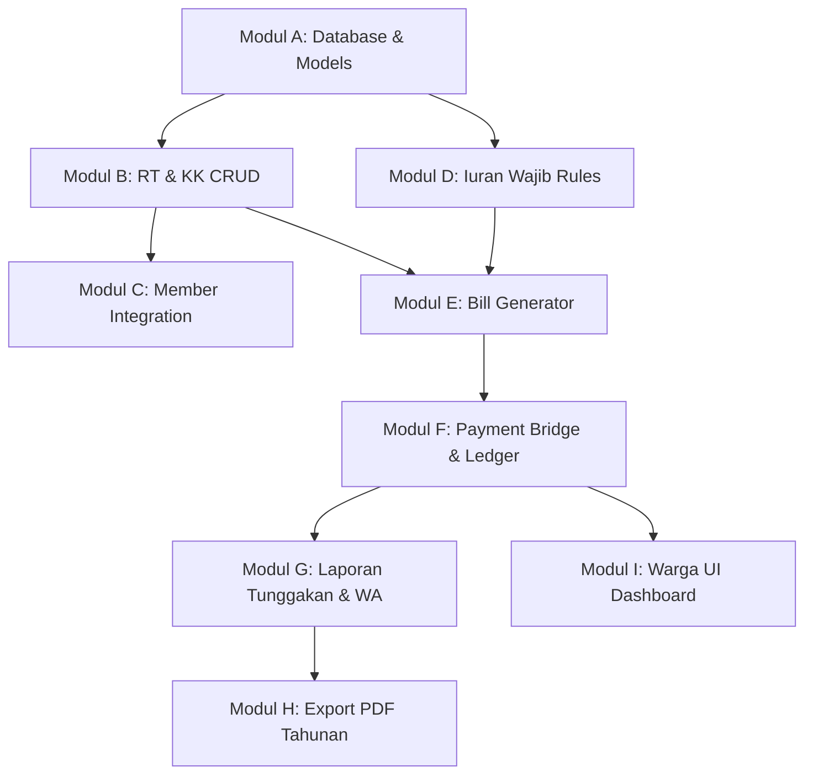

# AGENT.md - Panduan Utama Pengembangan Ecobank026

Dokumen ini adalah pedoman mutlak untuk seluruh proses pengembangan fitur, modifikasi, dan pemeliharaan aplikasi **Ecobank026** (khususnya untuk **TOPIK 15: Aplikasi Pengelolaan dan Pelaporan Kas RT/RW**). Setiap agen AI atau developer yang bekerja pada repositori ini wajib mematuhi aturan di dalam file ini untuk menjaga kestabilan sistem kas yang sudah berjalan.

---

## 1. Project Overview

* **Tujuan Aplikasi**: Menyediakan platform SaaS modern terpercaya untuk pengelolaan dana kas RT/RW tingkat mikro secara transparan serta operasional Bank Sampah warga secara terpadu.
* **Scope MVP (Topik 15)**:
  * Manajemen data wilayah terstruktur (**RT > KK > Warga**).
  * Pengaturan iuran bulanan wajib pada kategori dana kas.
  * Pencatatan/generate tagihan bulanan manual secara batch oleh admin.
  * Pembayaran tagihan dengan pencatatan kuitansi digital berbasis jembatan transaksi.
  * Pelaporan tunggakan iuran warga per RT dengan pengingat manual via WhatsApp Link (`wa.me`).
  * Integrasi otomatis pembayaran tagihan ke dalam Buku Kas Umum (Ledger).
  * Ekspor laporan tahunan kas mikro sederhana berbentuk PDF premium.
* **Arsitektur Utama**: Aplikasi berbasis monolitik MVC (Model-View-Controller) dengan memisahkan logika transaksi keuangan ke dalam Service Layer guna meminimalkan coupling dan duplikasi logika bisnis.

---

## 2. Tech Stack

* **Core Framework**: Laravel 11.x (PHP 8.2+)
* **Frontend Templating**: Laravel Blade dengan struktur layout modular
* **CSS Framework**: TailwindCSS untuk styling yang modern dan konsisten
* **Frontend Interactivity**: Alpine.js untuk reactive data binding ringan (modal, dropdown, tab)
* **Visualisasi Data**: ApexCharts untuk diagram statistik kas dan tabungan nasabah
* **Autentikasi & Otorisasi**: Spatie Laravel Permission (Roles final: `admin_rw`, `bendahara_rw`, `admin_rt`, `admin_bank_sampah`, `warga`, dengan alias `bendahara` untuk kompatibilitas filter dashboard)
* **Login Identifier**: **Nomor Telepon** (phone) sebagai primary identifier (tanpa email) dengan normalisasi cerdas prefix `620` / `62` ke format nasional `08...`.
* **Database**: MySQL / SQLite dengan integritas foreign key dan indeks unik yang ketat.

---

## 2a. Demo Credentials (Phone Login)

Untuk keperluan pengujian dan pengembangan, gunakan kredensial berbasis nomor telepon berikut (semua password adalah `password`):

| Role | No HP (Input Login) | Format Tersimpan | Deskripsi |
|---|---|---|---|
| **Admin RW** | `620811111111` | `0811111111` | Akses penuh seluruh tingkat RW |
| **Bendahara RW** | `620822222222` | `0822222222` | Pencatatan & kelola kas RW |
| **Admin RT** | `620833333333` | `0833333333` | Kelola wilayah RT 001, KK, & iuran warga |
| **Admin Bank Sampah** | `620844444444` | `0844444444` | Setoran, penarikan, & penjualan sampah |
| **Warga Demo** | `620855555555` | `0855555555` | Terhubung ke KK `3201234567890001` & Member `WRG026` |

---

## 3. Core Architecture Rules

> [!IMPORTANT]
> **ATURAN MUTLAK KAS (LEDGER):**
> * Tabel `community_cash_ledgers` adalah **satu-satunya core ledger / jurnal umum** aliran kas RT/RW di aplikasi ini.
> * Layanan **`App\Services\CommunityCashService.php`** adalah pusat perhitungan saldo kas dan **TIDAK BOLEH diubah sembarangan** untuk menghindari ketidakcocokan saldo historis (corrupt balances).
> * Fitur tagihan (`bills` & `bill_payments`) dirancang sebagai **layer tambahan** yang berdiri di atas sistem kas lama. Pembayaran tagihan secara otomatis memicu pemanggilan fungsi `recordContribution()` pada `CommunityCashService`.
> * **DB Transaction Wrapper**: Semua alur pembayaran iuran wajib dibungkus di dalam `DB::transaction` guna memastikan data jembatan (`bill_payments`), data tagihan (`bills`), dan data kas masuk (`community_contributions` & `community_cash_ledgers`) tersimpan secara atomik. Jika salah satu gagal, semuanya di-rollback.
> * **Service Layer**: Hindari menulis business logic di dalam Controller. Gunakan Service Class (seperti `BillService` dan `CommunityCashService`) agar kode reusable dan mudah diuji.
* **Blade Logic Restriction**: Dilarang membuat business logic langsung di Blade. Semua logic harus berasal dari Controller atau Service.
* **No Database Queries in Blade**: Hindari query database langsung di Blade view. Semua data harus disiapkan dan dikirimkan oleh Controller.

---

## 4. Data Architecture

Aliran data diatur secara hierarkis dan loosely-coupled:

1. **RT (Rukun Tetangga)** menjadi induk pengelompokan wilayah terkecil.
2. **KK (Kartu Keluarga)** memiliki relasi `belongsTo(Rt)`. Kolom `kk_number` bersifat **nullable** agar fleksibel di lapangan. KK memiliki atribut status (active, kontrak, pindah, kosong).
3. **Warga (Members)** dihubungkan ke KK melalui kolom `kk_id` (nullable, `onDelete('set null')`) dengan kolom `relationship` untuk mendefinisikan perannya (Kepala Keluarga, Istri, Anak, dll).
4. **Tagihan (Bills)** dibuat per KK untuk kategori kas (`fund_categories`) tertentu pada periode bulan & tahun tertentu.
5. **Kuitansi Pembayaran (Bill Payments)**: Menjembatani tabel `bills` dengan tabel transaksi kas lama `community_contributions`. Relasi `community_contribution_id` dikonfigurasi sebagai **`nullOnDelete`** sehingga apabila data kontribusi disesuaikan, riwayat pembayaran iuran KK tidak ikut terhapus dari sistem kuitansi.

---

## 5. Coding Standards

* **Thin Controller, Fat Service**: Controller hanya bertugas memvalidasi request HTTP, memanggil Service Method yang sesuai, dan mengembalikan response.
* **FormRequest Validation**: Setiap form input wajib menggunakan request validation class (e.g. `StoreKkRequest`, `PayBillRequest`) dengan validasi tipe data yang ketat.
* **Database Enums**: **HINDARI penggunaan ENUM di level database**. Gunakan string/varchar dengan validasi `in:val1,val2` pada level Request PHP untuk memudahkan perluasan status di masa depan.
* **Eager Loading**: Selalu gunakan eager loading (`with()`) saat memuat data relasi bertingkat (e.g. `Kk::with(['rt', 'members'])`) untuk menghindari problem query N+1.
* **Nullable Fields**: Buat field bernilai nullable jika data di lapangan sangat dinamis (seperti No KK, No Telepon, Alamat).
* **Pagination Required**: Semua query list utama wajib pagination untuk menjaga performa database.
* **Centralized Money Formatter**: Semua nominal uang wajib menggunakan helper/formatter terpusat (seperti format Rupiah terintegrasi) agar format mata uang seragam di seluruh UI.
* **Status Constant Control**: Hindari hardcoded text untuk status. Gunakan centralized constant/config/helper pada level Model (misalnya `const STATUS_ACTIVE = 'active'`) bila memungkinkan.

---

## 6. UI/UX Standards

* **Fintech Minimal Modern**: Desain dashboard minimalis, bersih, terpercaya, terinspirasi dari aplikasi finansial premium (bukan template admin generik yang penuh warna).
* **Konsistensi Desain**:
  * Cards: `rounded-2xl` dengan soft shadow (`shadow-sm` atau `shadow-md`).
  * Inputs: `rounded-xl` dengan focus ring bernuansa hijau emerald (`emerald-600`).
  * Buttons: `rounded-lg` dengan transisi warna yang halus saat hover.
  * Modals: `rounded-3xl` dengan backdrop filter blur.
* **Eco-Green Accents**: Nuansa warna dominan menggunakan palet Emerald/Green yang dikombinasikan dengan warna abu-abu netral (Slate/Zinc) untuk background.
* **Responsive Layout**: Semua elemen halaman (khususnya tabel iuran & tunggakan) wajib ramah layar ponsel/tablet melalui pendekatan grid Tailwind.
* **Mobile-First Approach**: Semua fitur baru wajib mempertimbangkan mobile layout terlebih dahulu (Mobile First) agar nyaman digunakan di ponsel warga.
* **No Component Over-Engineering**: Jangan membuat reusable component berlebihan pada MVP. Prioritaskan delivery cepat namun tetap maintainable.
* **Admin Table Standards**: Semua tabel admin wajib memiliki: search, filter dasar, empty state, dan loading state sederhana bila diperlukan.

---

## 7. Module Breakdown & Dependencies

MVP dibagi menjadi **9 modul independen** yang terstruktur untuk mencegah agen implementasi mengalami *chaos*:



---

## 8. Danger Zone (Zona Bahaya)

> [!CAUTION]
> **DILARANG MERUBAH:**
> 1. File **`app/Services/CommunityCashService.php`** ➔ Merupakan jantung keuangan kas mikro.
> 2. Tabel **`community_cash_ledgers`** beserta migrasinya ➔ Mengubah skema ledger akan menghancurkan data historis kas dan merusak perhitungan saldo.
> 3. Logika kalkulasi saldo akhir kas RT/RW yang sudah stabil.

---

## 9. Future Roadmap

1. **Import Excel KK**: Impor massal data KK dan anggota keluarga secara instan.
2. **WhatsApp Official API**: Integrasi notifikasi tagihan otomatis secara real-time via gateway WA API.
3. **QRIS Integration**: Pembayaran iuran digital otomatis via QRIS dinamis per KK.
4. **Multi RW**: Ekspansi fitur untuk mendukung pengelolaan di tingkat Kelurahan/Kecamatan dengan banyak RW sekaligus.
5. **Mobile Resident App**: Aplikasi mobile khusus warga untuk pemantauan iuran & saldo sampah.

---

## 10. Development Workflow

Setiap pengerjaan modul baru wajib mengikuti alur kerja disiplin berikut:

```
[1. Migration] ➔ [2. Model & Relasi] ➔ [3. Form Request] ➔ [4. Service Logic] ➔ [5. Controller] ➔ [6. Blade View] ➔ [7. Testing & Verifikasi]
```

1. **Migration**: Tulis dan jalankan migrasi database baru secara aman.
2. **Model**: Tambahkan properti fillable, casts, relasi Eloquent, dan helper method.
3. **Request**: Buat kelas validasi data untuk memproses request form dengan andal.
4. **Service**: Tulis logika bisnis utama dan interaksi database di dalam kelas service.
5. **Controller**: Hubungkan service dengan rute HTTP.
6. **Blade View**: Implementasikan antarmuka UI modern premium yang ramah responsif.
7. **Testing**: Lakukan uji coba input manual, verifikasi status database, dan jalankan linter PHP linter (`php -l`) sebelum commit.