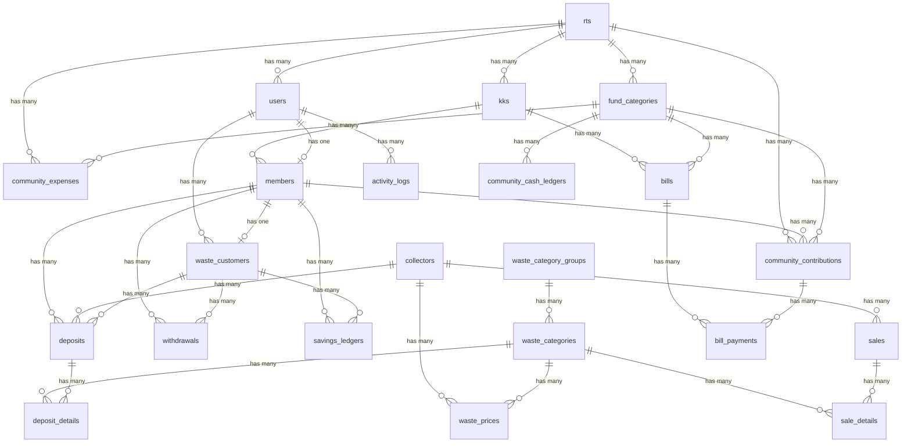

# ANALISIS SISTEM: ECOBANK026

Dokumen ini berisi analisis menyeluruh terhadap source code sistem **EcoBank026**. Analisis ini dirancang secara terstruktur dan faktual untuk digunakan sebagai dasar penyusunan **UML (Use Case, Activity, Sequence, Class Diagram)**, **ERD (Entity Relationship Diagram)**, serta **Dokumen Kerja Praktek (KP) atau Skripsi**.

---

## 1. RINGKASAN APLIKASI

Sistem **EcoBank026** adalah aplikasi terintegrasi yang menggabungkan dua domain bisnis utama di tingkat lingkungan Rukun Tetangga (RT) dan Rukun Warga (RW):
1. **Manajemen Kas & Tagihan Warga (Community Cash & Monthly Billing)**: Digunakan untuk mengelola kas warga, membuat kategori iuran wajib/sukarela, men-generate tagihan bulanan otomatis per Kartu Keluarga (KK), dan mencatat pengeluaran kas dengan validasi ketat.
2. **Operasional Bank Sampah (Waste Bank Operations & Savings)**: Wadah pemberdayaan ekonomi sirkular warga melalui penyetoran sampah terpilah, penarikan saldo tabungan, penjualan akumulasi sampah ke pengepul dengan sistem dual-pricing untuk menghitung margin keuntungan bank sampah, serta audit konsistensi saldo otomatis.

### Stack Teknologi
- **Core Framework**: Laravel v13.8 (PHP v8.3)
- **Front-end Engine**: Blade Templates, Tailwind CSS, Vite.js
- **Authentication**: Kustomisasi Laravel Breeze dengan metode masuk menggunakan nomor telepon (`phone`) sebagai identifier utama yang di-normalisasi (menggantikan email).
- **Libraries & Package Utama**:
  - `spatie/laravel-permission` (Role & Permission Management)
  - `maatwebsite/excel` (Bulk Data Import/Export)
- **Pola Arsitektur**: Model-View-Controller (MVC) yang diperkuat oleh **Service Layer Pattern** untuk memisahkan logika bisnis kompleks dari Controller guna menjaga skalabilitas dan konsistensi data.

---

## 2. ANALISIS ROLE DAN PERMISSION

Sistem menerapkan **Role-Based Access Control (RBAC)** menggunakan package `spatie/laravel-permission`. 

### A. Role yang Tersedia
1. **Admin RW (`admin_rw`)**: Pemegang otoritas tertinggi di tingkat Rukun Warga. Memiliki akses global ke semua modul kas warga (seluruh RT), data kependudukan, pengaturan global sistem, audit log, serta seluruh operasional bank sampah.
2. **Admin RT (`admin_rt`)**: Pengelola data di tingkat Rukun Tetangga tertentu. Hak akses dibatasi secara ketat menggunakan *RT Data Scoping* hanya untuk data warga, KK, kategori kas, setoran iuran, dan pengeluaran kas di lingkup RT-nya sendiri.
3. **Bendahara RW / Bendahara (`bendahara_rw` / `bendahara`)**: Bertanggung jawab penuh terhadap manajemen keuangan kas warga (pemasukan, pengeluaran, laporan tahunan, manajemen iuran, dan kategori kas) dengan akses global (untuk tingkat RW) atau lokal (untuk bendahara RT).
4. **Admin Bank Sampah (`admin_bank_sampah`)**: Petugas operasional yang menangani transaksi harian bank sampah, pendaftaran nasabah (warga maupun non-warga), pencatatan setoran sampah, penarikan tabungan nasabah, operasional biaya bank sampah, serta penjualan sampah ke pengepul.
5. **Warga (`warga`)**: Anggota masyarakat yang terdaftar. Hanya memiliki akses baca (read-only) untuk melihat dashboard pribadi, status tagihan iuran keluarga, riwayat saldo tabungan bank sampah sendiri, dan laporan kas publik.

---

### B. Matriks Role vs Fitur (Hak Akses)

| Nama Fitur / Modul | Admin RW | Admin RT | Bendahara RW/RT | Admin Bank Sampah | Warga |
| :--- | :---: | :---: | :---: | :---: | :---: |
| **Kelola Pengaturan Global & Audit Trail** | ✅ | ❌ | ❌ | ❌ | ❌ |
| **Kelola Data RT & Kartu Keluarga** | ✅ | ✅ | ✅ | ❌ | ❌ |
| **Kelola Data Warga (Member CRUD & Akun)**| ✅ | ✅ | ✅ | ❌ | ❌ |
| **Bulk Import Warga & KK dari Excel** | ✅ | ✅ | ✅ | ❌ | ❌ |
| **Kelola Kategori Kas (Iuran)** | ✅ | ✅ | ✅ | ❌ | ❌ |
| **Generate Tagihan Bulanan Otomatis** | ✅ | ✅ | ✅ | ❌ | ❌ |
| **Pencatatan Pembayaran Tagihan** | ✅ | ✅ | ✅ | ❌ | ❌ |
| **Pencatatan Pengeluaran Kas Warga** | ✅ | ✅ | ✅ | ❌ | ❌ |
| **Ekspor Laporan Kas Warga (Print/Excel)** | ✅ | ✅ | ✅ | ❌ | ❌ |
| **Kelola Profil Nasabah Bank Sampah** | ✅ | ❌ | ❌ | ✅ | ❌ |
| **Kelola Kategori & Harga Sampah** | ✅ | ❌ | ❌ | ✅ | ❌ |
| **Pencatatan Setoran Sampah (Deposit)** | ✅ | ❌ | ❌ | ✅ | ❌ |
| **Pencatatan Penarikan Tabungan** | ✅ | ❌ | ❌ | ✅ | ❌ |
| **Pencatatan Penjualan ke Pengepul** | ✅ | ❌ | ❌ | ✅ | ❌ |
| **Operasional Biaya Bank Sampah** | ✅ | ❌ | ❌ | ✅ | ❌ |
| **Audit Konsistensi Saldo Bank Sampah** | ✅ | ❌ | ❌ | ✅ | ❌ |
| **Melihat Dashboard & Tabungan Sendiri**| ✅ | ✅ | ❌ | ❌ | ✅ |
| **Melihat Laporan Kas Publik** | ✅ | ✅ | ❌ | ❌ | ✅ |

---

## 3. ANALISIS ROUTE

Rute dikelompokkan secara logis ke dalam middleware otentikasi (`auth`) dan batasan permission Spatie.

### A. Modul Kependudukan & Administrasi
- `rts` *(Resource, RW/RT Admin)*: CRUD data RT.
- `kks` *(Resource, RW/RT Admin)*: CRUD data Kartu Keluarga.
- `kks/import` *(GET/POST, RW/RT Admin)*: Bulk import KK via file Excel.
- `members` *(Resource, RW/RT Admin)*: CRUD data demografi warga.
- `members/{member}/create-login-account` *(POST)*: Pembuatan akun login warga (phone + password).
- `members/{member}/reset-password` *(POST)*: Reset password akun login warga.
- `members/import-v2` *(GET/POST)*: Bulk import data warga versi mutakhir dengan validasi dan unduh data gagal baris.

### B. Modul Keuangan & Tagihan Warga
- `community-cash/categories` *(Resource, Permission: manage_fund_categories)*: Mengelola kategori dana kas (sosial, keamanan, kebersihan, dll).
- `community-cash/contributions` *(Resource, Permission: manage_contributions)*: Pencatatan setoran iuran kas warga secara manual.
- `community-cash/expenses` *(Resource, Permission: manage_expenses)*: Pencatatan pengeluaran kas warga dengan validasi saldo minimal.
- `community-cash/report` *(GET, Permission: view_cash_reports)*: Dashboard rekap laporan kas RT/RW.
- `iuran/tagihan` *(GET, Permission: manage_contributions)*: Daftar status tagihan warga.
- `iuran/tagihan/generate` *(GET/POST, Permission: manage_contributions)*: Generate iuran bulanan wajib otomatis per KK.
- `iuran/tagihan/{bill}/pay` *(POST, Permission: manage_contributions)*: Pencatatan pembayaran tagihan (tunai/transfer/QRIS) secara penuh atau sebagian.
- `iuran/tunggakan` *(GET)*: Rekap data KK yang menunggak pembayaran iuran wajib.
- `iuran/laporan-tahunan` *(GET)*: Rekap laporan tahunan kas dan tagihan warga.

### C. Modul Bank Sampah
- `bank-sampah/customers` *(Resource, Permission: manage_waste_customers)*: CRUD data nasabah bank sampah.
- `bank-sampah/waste-categories` *(Resource, Permission: manage_waste_prices)*: CRUD data katalog jenis sampah.
- `bank-sampah/waste-category-groups` *(Resource, Permission: manage_waste_prices)*: CRUD kelompok sampah (Plastik, Kertas, Logam, Kaca).
- `bank-sampah/waste-prices` *(Resource, Permission: manage_waste_prices)*: CRUD dual-pricing katalog (harga beli dari nasabah vs harga jual ke pengepul).
- `bank-sampah/collectors` *(Resource, Permission: manage_waste_prices)*: CRUD mitra pengepul sampah.
- `bank-sampah/deposits` *(Resource, Permission: manage_deposits)*: Pencatatan transaksi setoran sampah warga.
- `bank-sampah/withdrawals` *(Resource, Permission: manage_withdrawals)*: Pencatatan transaksi penarikan saldo tabungan warga.
- `bank-sampah/sales` *(Resource, Permission: manage_sales)*: Pencatatan transaksi penjualan sampah terakumulasi ke pengepul.
- `bank-sampah/expenses` *(Resource, Role: admin_bank_sampah|admin_rw)*: Biaya operasional bank sampah.
- `bank-sampah/monitoring` *(GET, Role: admin_bank_sampah|admin_rw)*: Dashboard monitoring & audit konsistensi saldo bank sampah.
- `bank-sampah/reports/*` *(GET)*: Laporan setoran, penjualan, jurnal tabungan, dan arus kas bank sampah.

### D. Modul Portal Mandiri Warga
- `warga/dashboard` *(GET, Permission: view_own_dashboard)*: Dashboard ringkasan pribadi warga.
- `warga/cash-report` *(GET, Permission: view_public_cash_report)*: Melihat arus kas warga transparan secara real-time.
- `warga/savings` & `warga/savings/history` *(GET, Permission: view_own_savings)*: Melihat saldo dan mutasi tabungan bank sampah keluarga.
- `warga/tagihan` *(GET)*: Portal cek tagihan bulanan KK yang belum dibayar.

---

## 4. ANALISIS DATABASE (PHYSICAL SCHEMA)

Database memiliki struktur relasional yang teratur. Berikut adalah tabel-tabel utama yang benar-benar digunakan beserta fungsinya, mengabaikan tabel bawaan framework standard yang tidak terkait proses bisnis (seperti `failed_jobs`, `password_reset_tokens`).

### A. Tabel Administrasi & Kependudukan

#### 1. Tabel `rts`
- **Fungsi**: Menyimpan data Rukun Tetangga (RT) dalam lingkungan Rukun Warga (RW).
- **Kolom Utama**:
  - `id` (PK, bigint)
  - `rt_number` (varchar, misal '001', '002')
  - `description` (text, keterangan lokasi/nama RT)
  - `created_at` / `updated_at` (timestamp)

#### 2. Tabel `kks`
- **Fungsi**: Menyimpan data Kartu Keluarga (KK) yang berdomisili di lingkungan RW.
- **Kolom Utama**:
  - `id` (PK, bigint)
  - `rt_id` (FK to `rts`, nullable jika data tidak berscope RT)
  - `kk_number` (varchar, nomor KK 16 digit)
  - `family_head` (varchar, nama kepala keluarga)
  - `address` (text, alamat rumah)
  - `phone` (varchar, nomor kontak perwakilan KK)
  - `status` (enum: 'active', 'kontrak', 'pindah', 'kosong')

#### 3. Tabel `members`
- **Fungsi**: Menyimpan data demografi warga secara individual yang tergabung dalam suatu KK.
- **Kolom Utama**:
  - `id` (PK, bigint)
  - `user_id` (FK to `users`, nullable, terisi jika warga dibuatkan akun login)
  - `kk_id` (FK to `kks`, mengikat warga ke dalam KK tertentu)
  - `member_code` (varchar, kode unik warga otomatis misal 'WRG001')
  - `name` (varchar, nama lengkap warga)
  - `phone` (varchar, nullable, kontak pribadi warga)
  - `birth_date` (date, tanggal lahir untuk kalkulasi kelompok umur)
  - `gender` (enum: 'L', 'P')
  - `relationship` (varchar, status dalam keluarga misal: 'Kepala Keluarga', 'Istri', 'Anak')
  - `deleted_at` (timestamp, mendukung Soft Deletes)

#### 4. Tabel `users`
- **Fungsi**: Kredensial akun pengguna untuk masuk ke dalam aplikasi.
- **Kolom Utama**:
  - `id` (PK, bigint)
  - `rt_id` (FK to `rts`, nullable, menentukan scope RT bagi admin RT)
  - `name` (varchar, nama pengguna)
  - `email` (varchar, nullable)
  - `phone` (varchar, unique, nomor telepon sebagai username login)
  - `password` (varchar, hash sandi keamanan)

---

### B. Tabel Keuangan & Kas Warga

#### 5. Tabel `fund_categories`
- **Fungsi**: Katalog jenis iuran warga. Bisa dikonfigurasi sebagai iuran wajib berkala atau sukarela.
- **Kolom Utama**:
  - `id` (PK, bigint)
  - `rt_id` (FK to `rts`, nullable, jika bernilai NULL berarti kategori kas berlaku global/tingkat RW)
  - `name` (varchar, nama kas misal 'Kas Keamanan', 'Iuran Kematian')
  - `description` (text, keterangan peruntukan kas)
  - `target_amount` (decimal, target nominal dana yang ingin dicapai, nullable)
  - `is_active` (boolean, status aktif/nonaktif)
  - `is_mandatory` (boolean, jika bernilai TRUE maka tagihan bulanan otomatis akan di-generate untuk kategori ini)
  - `monthly_amount` (decimal, besaran iuran wajib per bulan jika merupakan iuran wajib)

#### 6. Tabel `community_contributions`
- **Fungsi**: Mencatat riwayat pemasukan dana/kas iuran yang disetorkan oleh warga.
- **Kolom Utama**:
  - `id` (PK, bigint)
  - `fund_category_id` (FK to `fund_categories`)
  - `rt_id` (FK to `rts`, nullable, menyimpan scope RT transaksi pemasukan)
  - `member_id` (FK to `members`, nullable, mengidentifikasi warga penyetor)
  - `member_name` (varchar, nama warga penyetor - cadangan jika `member_id` kosong)
  - `amount` (decimal, nominal uang yang disetorkan)
  - `date` (date, tanggal penyetoran iuran)
  - `description` (text, catatan penjelasan penyetoran)
  - `recorded_by` (FK to `users`, admin/bendahara pencatat)

#### 7. Tabel `community_expenses`
- **Fungsi**: Mencatat pengeluaran kas warga untuk alokasi operasional sosial lingkungan.
- **Kolom Utama**:
  - `id` (PK, bigint)
  - `fund_category_id` (FK to `fund_categories`)
  - `rt_id` (FK to `rts`, nullable, menyimpan scope RT transaksi pengeluaran)
  - `amount` (decimal, nominal pengeluaran kas)
  - `date` (date, tanggal pengeluaran)
  - `description` (text, alasan/keterangan pengeluaran)
  - `recorded_by` (FK to `users`, pencatat pengeluaran)

#### 8. Tabel `community_cash_ledgers`
- **Fungsi**: Buku besar (Double-Entry Ledger) rekap kas warga. Berfungsi untuk menghitung saldo berjalan (*running balance*) kas warga secara real-time.
- **Kolom Utama**:
  - `id` (PK, bigint)
  - `fund_category_id` (FK to `fund_categories`)
  - `type` (enum: 'in', 'out')
  - `amount` (decimal, nominal mutasi)
  - `balance` (decimal, saldo akhir setelah mutasi terjadi)
  - `reference_type` (enum: 'contribution', 'expense', mereferensikan sumber pencatatan)
  - `reference_id` (bigint, ID dari tabel `community_contributions` atau `community_expenses`)
  - `date` (date)
  - `description` (varchar)

#### 9. Tabel `bills`
- **Fungsi**: Menyimpan tagihan iuran bulanan wajib yang diterbitkan untuk setiap KK.
- **Kolom Utama**:
  - `id` (PK, bigint)
  - `kk_id` (FK to `kks`)
  - `fund_category_id` (FK to `fund_categories`)
  - `bill_code` (varchar, nomor tagihan unik misal 'BILL-202605-RT001-0001')
  - `amount` (decimal, nominal tagihan berdasarkan setelan kategori kas)
  - `due_date` (date, tanggal jatuh tempo pembayaran)
  - `month` (integer, periode bulan tagihan 1-12)
  - `year` (integer, periode tahun tagihan)
  - `status` (enum: 'unpaid', 'partially_paid', 'paid')

#### 10. Tabel `bill_payments`
- **Fungsi**: Mencatat riwayat pembayaran cicilan/penuh atas tagihan bulanan.
- **Kolom Utama**:
  - `id` (PK, bigint)
  - `bill_id` (FK to `bills`)
  - `community_contribution_id` (FK to `community_contributions`, relasi ke mutasi pemasukan kas)
  - `receipt_number` (varchar, nomor kuitansi otomatis misal 'RCPT-202605-0001')
  - `amount_paid` (decimal, nominal pembayaran)
  - `payment_method` (varchar, 'cash', 'transfer', 'qris')
  - `paid_at` (datetime, waktu pembayaran dilakukan)

---

### C. Tabel Operasional Bank Sampah

#### 11. Tabel `collectors`
- **Fungsi**: Menyimpan daftar mitra pengepul sampah (tujuan penjualan sampah skala besar).
- **Kolom Utama**:
  - `id` (PK, bigint)
  - `name` (varchar, nama pengepul/perusahaan)
  - `phone` (varchar, nomor kontak pengepul)
  - `address` (text, alamat tempat pengepul)
  - `deleted_at` (timestamp, mendukung Soft Deletes)

#### 12. Tabel `waste_category_groups`
- **Fungsi**: Menyimpan data kelompok sampah (Kategori Induk) misal Plastik, Kertas, dll.
- **Kolom Utama**:
  - `id` (PK, bigint)
  - `code` (varchar, kode kelompok misal 'PLS', 'LOG', 'KRT')
  - `name` (varchar, nama kelompok sampah)
  - `description` (text, deskripsi kelompok sampah)
  - `is_active` (boolean)

#### 13. Tabel `waste_categories`
- **Fungsi**: Menyimpan spesifikasi detail item sampah yang dapat ditabung nasabah.
- **Kolom Utama**:
  - `id` (PK, bigint)
  - `waste_category_group_id` (FK to `waste_category_groups`, nullable)
  - `code` (varchar, kode jenis sampah misal 'PLS.01', 'KRT.02')
  - `name` (varchar, nama jenis sampah misal 'Botol PET Bersih', 'Kardus Cokelat')
  - `unit` (varchar, satuan berat misal 'kg', 'pcs')
  - `category_group` (varchar, legacy string untuk backwards compatibility)

#### 14. Tabel `waste_prices`
- **Fungsi**: Menyimpan katalog harga jual dan beli sampah (Dual-pricing catalog). Harga dibedakan antara harga ke warga (`member_price`) dan harga ke pengepul (`collector_price`) untuk menghitung margin bank sampah.
- **Kolom Utama**:
  - `id` (PK, bigint)
  - `waste_category_id` (FK to `waste_categories`)
  - `collector_id` (FK to `collectors`)
  - `price_per_unit` (decimal, legacy price)
  - `member_price` (decimal, harga yang diberikan kepada nasabah saat menyetor sampah)
  - `collector_price` (decimal, harga yang didapatkan bank sampah saat menjual ke pengepul ini)

#### 15. Tabel `waste_customers`
- **Fungsi**: Menyimpan profil nasabah bank sampah. Nasabah bisa berelasi dengan warga dalam KK (`member_id`), atau nasabah eksternal dari luar lingkungan RW.
- **Kolom Utama**:
  - `id` (PK, bigint)
  - `user_id` (FK to `users`, nullable, jika nasabah memiliki akun login sistem)
  - `member_id` (FK to `members`, nullable, menghubungkan nasabah dengan data warga demografi)
  - `customer_code` (varchar, kode nasabah unik otomatis misal 'NSB-202605-0001')
  - `name` (varchar, nama lengkap nasabah)
  - `phone` (varchar, nomor telepon nasabah)
  - `address` (text, alamat tinggal nasabah)
  - `status` (varchar, 'active', 'inactive')
  - `joined_at` (datetime, tanggal bergabung menjadi nasabah)

#### 16. Tabel `deposits`
- **Fungsi**: Mencatat induk transaksi setoran sampah nasabah.
- **Kolom Utama**:
  - `id` (PK, bigint)
  - `member_id` (FK to `members`, nullable - legacy connection)
  - `waste_customer_id` (FK to `waste_customers`, nullable - target utama nasabah penyetor)
  - `collector_id` (FK to `collectors`, target pengepul yang mensponsori harga transaksi)
  - `date` (date, tanggal penyetoran sampah)
  - `total_amount` (decimal, akumulasi total rupiah setoran yang masuk ke saldo tabungan nasabah)
  - `notes` (text, nullable)

#### 17. Tabel `deposit_details`
- **Fungsi**: Detail baris transaksi jenis sampah yang disetorkan pada suatu penyetoran (`deposits`).
- **Kolom Utama**:
  - `id` (PK, bigint)
  - `deposit_id` (FK to `deposits`)
  - `waste_category_id` (FK to `waste_categories`)
  - `weight` (decimal, berat/jumlah sampah yang disetorkan)
  - `price_per_unit` (decimal, nominal rupiah per unit yang didapat nasabah - disalin dari `member_price`)
  - `subtotal` (decimal, `weight * price_per_unit`)

#### 18. Tabel `withdrawals`
- **Fungsi**: Mencatat transaksi penarikan saldo tabungan oleh nasabah bank sampah.
- **Kolom Utama**:
  - `id` (PK, bigint)
  - `member_id` (FK to `members`, nullable)
  - `waste_customer_id` (FK to `waste_customers`, nullable)
  - `amount` (decimal, nominal saldo tabungan yang ditarik tunai)
  - `date` (date, tanggal pencairan dana tabungan)
  - `notes` (text, nullable)

#### 19. Tabel `savings_ledgers`
- **Fungsi**: Buku tabungan nasabah bank sampah. Mencatat sejarah penambahan saldo (`credit` dari setoran sampah) dan pengurangan saldo (`debit` dari penarikan tunai).
- **Kolom Utama**:
  - `id` (PK, bigint)
  - `member_id` (FK to `members`, nullable)
  - `waste_customer_id` (FK to `waste_customers`, nullable)
  - `type` (enum: 'credit', 'debit')
  - `amount` (decimal, nominal mutasi saldo)
  - `description` (varchar, penjelasan transaksi)
  - `reference_type` (varchar, kelas model referensi misal 'App\Models\Deposit', 'App\Models\Withdrawal')
  - `reference_id` (bigint, ID instansi sumber mutasi)

#### 20. Tabel `sales`
- **Fungsi**: Mencatat transaksi penjualan tumpukan sampah terpilah dari gudang bank sampah kepada pengepul besar secara berkala.
- **Kolom Utama**:
  - `id` (PK, bigint)
  - `collector_id` (FK to `collectors`)
  - `date` (date, tanggal penjualan sampah ke pengepul)
  - `total_amount` (decimal, total uang penjualan yang diterima bank sampah dari pengepul)
  - `notes` (text, nullable)

#### 21. Tabel `sale_details`
- **Fungsi**: Detail baris item sampah yang dijual kepada pengepul dalam transaksi `sales`.
- **Kolom Utama**:
  - `id` (PK, bigint)
  - `sale_id` (FK to `sales`)
  - `waste_category_id` (FK to `waste_categories`)
  - `weight` (decimal, berat sampah yang dijual)
  - `price_per_unit` (decimal, harga beli pengepul - disalin dari `collector_price`)
  - `subtotal` (decimal, `weight * price_per_unit`)

#### 22. Tabel `waste_bank_cash_ledgers`
- **Fungsi**: Buku besar kas operasional bank sampah. Mencatat uang kas nyata bank sampah yang diperoleh dari keuntungan margin penjualan sampah ke pengepul (`type: in` senilai selisih `collector_price - member_price`) serta operasional keluar (`type: out`).
- **Kolom Utama**:
  - `id` (PK, bigint)
  - `type` (enum: 'in', 'out')
  - `amount` (decimal, nominal mutasi kas)
  - `balance` (decimal, saldo kas operasional bank sampah berjalan)
  - `reference_type` / `reference_id` (morphs, terhubung ke transaksi penjualan `Sale` atau pengeluaran `WasteBankExpense`)
  - `date` (date)
  - `description` (varchar)

#### 23. Tabel `waste_bank_expenses`
- **Fungsi**: Mencatat biaya pengeluaran untuk kebutuhan operasional harian bank sampah.
- **Kolom Utama**:
  - `id` (PK, bigint)
  - `expense_code` (varchar, nomor pengeluaran otomatis misal 'EXP-202605-0001')
  - `amount` (decimal, besaran nominal biaya pengeluaran)
  - `description` (text, keperluan pengeluaran)
  - `expense_date` (date, tanggal pengeluaran)
  - `recorded_by` (FK to `users`, petugas pencatat)
  - `proof_path` (varchar, path file bukti nota fisik pengeluaran, nullable)

---

### D. Tabel Keamanan & Penunjang Aplikasi

#### 24. Tabel `activity_logs`
- **Fungsi**: Audit trail keamanan untuk mencatat aktivitas penting secara immutable (tidak bisa di-update/delete setelah dibuat).
- **Kolom Utama**:
  - `id` (PK, bigint)
  - `user_id` (FK to `users`, nullable, aktor yang melakukan tindakan)
  - `severity` (enum: 'info', 'warning', 'critical')
  - `event_type` (varchar, jenis aktivitas misal: 'deposit.create', 'withdrawal.create', 'bill.payment', 'waste_customer.create')
  - `description` (text, narasi log)
  - `ip_address` / `user_agent` (varchar)
  - `correlation_id` (varchar, UUID penanda rangkaian transaksi)
  - `payload` (json, payload data mentah sebelum dan sesudah perubahan)
  - `created_at` (datetime)

#### 25. Tabel `app_settings`
- **Fungsi**: Konfigurasi parameter operasional sistem secara dinamis di database.
- **Kolom Utama**:
  - `id` (PK, bigint)
  - `key` (varchar, unique, kode setelan misal: 'billing.default_due_days', 'billing.bill_prefix')
  - `value` (text, isi nilai konfigurasi)
  - `type` (varchar, tipe data penentu casting misal: 'integer', 'string', 'boolean')
  - `setting_group` (varchar, pengelompokan konfigurasi)

#### 26. Tabel `import_histories`
- **Fungsi**: Log riwayat bulk import data warga/kategori sampah dari Excel.
- **Kolom Utama**:
  - `id` (PK, bigint)
  - `filename` (varchar, nama file yang diunggah)
  - `import_type` (varchar, jenis objek data import misal: 'member', 'waste_price')
  - `user_id` (FK to `users`, admin pelaksana)
  - `total_rows` / `total_success` / `total_failed` / `total_skipped` / `total_duplicates` (integer)

---

## 5. ANALISIS PROSES BISNIS & ATURAN VALIDASI (BUSINESS LOGIC)

### A. Modul Kependudukan
- **Tujuan**: Mengelola basis data RT, KK, dan data warga sebagai pondasi pemetaan kewajiban iuran kas serta nasabah bank sampah.
- **Alur Bisnis**:
  1. Admin menginput/mengimpor KK dan mengaitkannya ke RT terdaftar.
  2. Anggota KK didaftarkan sebagai `Member` dengan mendefinisikan hubungan keluarga (Kepala Keluarga, Istri, Anak).
  3. Anggota keluarga yang berstatus "Kepala Keluarga" akan otomatis ditunjuk sebagai penanggung jawab utama tagihan iuran.
  4. Akun login warga dapat dibuat menggunakan data nomor telepon yang divalidasi.
- **Aturan Bisnis Utama & Validasi Penting**:
  - Nomor KK wajib memiliki panjang tepat 16 digit angka numerik.
  - Kode Warga (`member_code`) diterbitkan otomatis dengan format `WRG[increment]` (misal: `WRG026`).
  - *Data Scoping RT* (`RtScopeService`): Admin RT hanya dapat melihat, menambah, atau mengedit KK/Warga yang berada di bawah naungan `rt_id` miliknya sendiri. Jika `rt_id` admin RT bernilai NULL, data sengaja disajikan kosong untuk mencegah kebocoran informasi.
  - Anggota warga yang dihapus menggunakan fitur *Soft Deletes* untuk menjamin integritas relasi tagihan historis.

---

### B. Modul Kas & Tagihan Warga
- **Tujuan**: Mengotomatisasi penagihan iuran wajib bulanan warga dan mengelola arus kas pemasukan-pengeluaran sosial lingkungan.
- **Alur Bisnis**:
  1. Admin mendaftarkan kategori iuran kas (`fund_categories`). Jika iuran wajib, kolom `is_mandatory` diset TRUE dan nominal `monthly_amount` diisi angka > 0.
  2. Setiap bulan, admin memicu proses **Generate Tagihan**.
  3. Sistem memindai seluruh KK yang berstatus aktif atau kontrak, lalu menerbitkan record `bills` baru untuk kategori iuran wajib pada bulan & tahun tersebut.
  4. Pembayaran tagihan dilakukan secara cicilan/lunas. Setiap pencatatan pembayaran tagihan (`bills.pay`) secara otomatis:
     - Menerbitkan nomor bukti bayar (`receipt_number`).
     - Menyimpan record pemasukan kas di `community_contributions`.
     - Menyimpan record mutasi pemasukan di buku besar `community_cash_ledgers`, serta menambahkan saldo berjalan kategori kas tersebut.
     - Memperbarui status tagihan menjadi `paid` (jika lunas) atau `partially_paid` (jika nominal bayar belum melunasi tagihan).
  5. Pengeluaran kas dicatat manual oleh admin/bendahara melalui form `expenses`, yang akan langsung mendebit saldo berjalan di tabel `community_cash_ledgers`.
- **Aturan Bisnis Utama & Validasi Penting**:
  - **Pencegahan Duplikasi**: Proses generate tagihan memeriksa keunikan kombinasi `kk_id`, `fund_category_id`, `month`, dan `year`. Jika tagihan periode tersebut sudah ada, sistem akan melewatinya.
  - **Format Kode Tagihan**: Kode tagihan dihasilkan otomatis dengan rumus: `[PREFIX]-[PERIOD:YYYYMM]-RT[RT_NUMBER]-[INCREMENT]`.
  - **Pembayaran Aman**: Nominal bayar tidak boleh melebihi sisa tagihan berjalan (`amount - total_paid`).
  - **Saldo Pengeluaran**: Pengeluaran kas warga (`expenses`) **dilarang melebihi saldo kas berjalan** kategori kas tersebut. Jika saldo tidak cukup, sistem akan melempar `InsufficientBalanceException` dan membatalkan transaksi database via Rollback.

---

### C. Modul Operasional Bank Sampah

#### 1. Manajemen Nasabah (`WasteCustomer`)
- Nasabah bank sampah didaftarkan dengan status awal `active`.
- Nasabah bisa dihubungkan dengan data warga resmi (`member_id` terisi), atau didaftarkan sebagai nasabah luar lingkungan RW (`member_id = null`).
- **Aturan Keamanan Penghapusan**: Nasabah yang sudah memiliki catatan riwayat setoran (`deposits`), penarikan (`withdrawals`), atau buku tabungan (`savings_ledgers`) **sama sekali tidak boleh dihapus dari sistem** demi menjaga konsistensi keuangan audit. Upaya menghapus nasabah bersaldo aktif akan diblokir, dicatat sebagai alert `warning` di audit log, dan admin disarankan mengubah status nasabah menjadi `inactive`.

#### 2. Transaksi Setoran Sampah (`deposits`)
- Petugas menginput nasabah, pengepul, tanggal, dan daftar jenis sampah beserta beratnya.
- **Aturan Kalkulasi**: Subtotal setoran dihitung per baris sampah: `weight * member_price`. Total nilai setoran langsung ditambahkan ke saldo tabungan nasabah.
- **Efek Sistem**: Data tersimpan ke `deposits` dan `deposit_details`, kemudian menerbitkan mutasi masuk (`credit`) di tabel buku tabungan `savings_ledgers`.

#### 3. Transaksi Penarikan Saldo Tabungan (`withdrawals`)
- Nasabah mengajukan penarikan tunai saldo tabungan mereka.
- **Aturan Validasi Minimum Setoran**: Nasabah **wajib memiliki minimal 2 kali transaksi setoran sampah** (`deposits`) di masa lalu sebelum diperbolehkan melakukan penarikan dana untuk pertama kalinya. Validasi ini diperiksa melalui service `BankSampahService::MIN_DEPOSITS_BEFORE_WITHDRAWAL`. Jika kurang dari 2 kali, sistem memblokir dan melempar `MinimumDepositException`.
- **Aturan Validasi Batas Saldo**: Nominal penarikan tidak boleh melebihi saldo tabungan berjalan nasabah. Jika melebihi saldo, sistem memblokir dan melempar `InsufficientBalanceException`.
- **Efek Sistem**: Menerbitkan record keluar (`debit`) di buku tabungan `savings_ledgers`.

#### 4. Transaksi Penjualan ke Pengepul & Keuntungan Margin (`sales`)
- Sampah terpilah di gudang bank sampah dijual secara massal kepada pengepul terpilih.
- **Aturan Dual-Pricing & Margin Keuntungan**: Keuntungan operasional bank sampah diperoleh dari selisih harga jual ke pengepul (`collector_price`) dan harga beli dari nasabah (`member_price`).
  - Rumus Margin per item sampah: `Margin = (collector_price - member_price) * weight`.
- **Aturan Bisnis Utama**:
  - Total keuntungan margin penjualan **wajib bernilai positif** (>= 0). Jika margin bernilai negatif (karena harga beli ke warga disetel lebih tinggi dari harga beli pengepul), transaksi ditolak (`InvalidArgumentException`).
  - Total keuntungan margin ini secara otomatis didepositkan ke kas operasional bank sampah melalui pencatatan mutasi masuk (`type: in`) di tabel `waste_bank_cash_ledgers`.
  - Kas bank sampah digunakan untuk mendanai biaya operasional (seperti pembelian timbangan, kantong) yang dicatat di tabel `waste_bank_expenses`, yang memotong saldo kas bank sampah berjalan (`waste_bank_cash_ledgers`).

#### 5. Sistem Audit Konsistensi Saldo (`BankSampahAuditService`)
- Sistem memiliki mekanisme audit mandiri untuk memverifikasi kesehatan data saldo tabungan secara otomatis.
- Proses audit memindai:
  - Kecocokan saldo: Selisih antara rekap transaksi fisik (`sum(deposits) - sum(withdrawals)`) dengan saldo di buku besar tabungan nasabah (`sum(ledger_credit) - sum(ledger_debit)`).
  - Saldo negatif nasabah.
  - Duplikasi pencatatan buku besar tabungan berdasarkan kecocokan ID referensi.
  - Transaksi yatim (orphan transactions/ledgers) yang kehilangan relasi parent-child.
- **Output Audit**: Sistem menghitung indeks kesehatan data (*Health Score*) dari skala 0-100 dengan bobot pengurangan nilai untuk setiap jenis anomali yang ditemukan.

---

## 6. ANALISIS CONTROLLER DAN SERVICE UTAMA

Sistem mengadopsi prinsip pemisahan tanggung jawab (Separation of Concerns). Logika rumit dipindahkan ke kelas Service khusus.

### A. Kelas Service & Tanggung Jawab

#### 1. `RtScopeService`
- **Tanggung Jawab**: Menyediakan mekanisme filter data (*data scoping*) berbasis Rukun Tetangga (RT). Kelas ini menganalisis peran user yang login, membedakan hak akses global (Admin RW, Bendahara RW) dan lokal (Admin RT), serta menyisipkan klausa Eloquent Query `where('rt_id', ...)` atau relasi `whereHas('kk', ...)` secara konsisten untuk mencegah kebocoran data antar RT.

#### 2. `BillService`
- **Tanggung Jawab**: Menangani orkestrasi penerbitan tagihan bulanan massal untuk warga aktif, pengecekan keunikan tagihan per periode untuk menghindari duplikasi, pencatatan pembayaran tagihan, kalkulasi tunggakan, penyesuaian otomatis status pembayaran tagihan (`paid`, `partially_paid`, `unpaid`), serta penulisan log transaksi pembayaran.

#### 3. `CommunityCashService`
- **Tanggung Jawab**: Mengelola penulisan ganda (*double-entry*) keuangan warga. Menjamin setiap pencatatan pemasukan iuran (`contributions`) dan pengeluaran kas (`expenses`) ter-koneksi langsung dengan record mutasi saldo di buku besar kas warga (`community_cash_ledgers`), serta menghitung ulang saldo berjalan jika terjadi koreksi data.

#### 4. `BankSampahService`
- **Tanggung Jawab**: Mengatur alur kerja transaksi bank sampah. Mengkalkulasi nilai setoran sampah nasabah, menguji aturan kelayakan transaksi penarikan saldo (syarat minimal 2 kali setor dan limit saldo), menghitung margin keuntungan bank sampah dari selisih harga dual-pricing saat penjualan ke pengepul, serta menuliskan catatan kas operasional bank sampah.

#### 5. `BankSampahAuditService`
- **Tanggung Jawab**: Mesin audit integritas data keuangan nasabah. Melakukan pemindaian mendalam (*deep scan*) untuk mendeteksi deviasi/ketidakcocokan saldo, anomali saldo negatif, duplikasi data, dan transaksi yatim tanpa referensi lengkap, guna menghasilkan data *Health Score* kesehatan database bank sampah.

#### 6. `ActivityLogService`
- **Tanggung Jawab**: Layanan pencatatan jejak audit (*audit trail*) secara mandiri. Mengambil metadata pengguna, alamat IP, jenis peramban, korelasi ID transaksi, serta payload data sebelum dan sesudah perubahan untuk disimpan ke dalam log permanen yang tidak dapat dimodifikasi.

---

### B. Kelas Controller & Tanggung Jawab

#### 1. `DashboardController`
- **Tanggung Jawab**: Menyajikan data visual ringkasan sistem. Mengalihkan navigasi beranda sesuai dengan peran (role) pengguna, merangkum angka statistik iuran, tagihan berjalan, saldo kas warga, total tabungan nasabah, sisa sampah di gudang, keuntungan bank sampah, dan grafik mingguan.

#### 2. `BillController`
- **Tanggung Jawab**: Mengendalikan halaman administrasi tagihan warga. Menyediakan form generate iuran, pencatatan pembayaran, pencarian tagihan, ekspor laporan tahunan, dan rekapitulasi tunggakan warga.

#### 3. `DepositController` & `WithdrawalController`
- **Tanggung Jawab**: Mengontrol antarmuka pencatatan setoran sampah nasabah dan pencairan tabungan nasabah, berkolaborasi dengan `BankSampahService` untuk mengeksekusi validasi aturan bisnis.

#### 4. `SaleController`
- **Tanggung Jawab**: Mengelola proses penjualan sampah ke pengepul, mengumpulkan catalog harga pengepul untuk disajikan ke petugas, dan memproses pembagian margin laba bank sampah.

#### 5. `WasteCustomerController`
- **Tanggung Jawab**: Mengelola daftaran nasabah bank sampah, menampilkan profil visual nasabah beserta riwayat buku tabungan lengkap.

#### 6. `AppSettingController`
- **Tanggung Jawab**: Mengatur preferensi sistem (seperti prefix kode tagihan, kuitansi, jatuh tempo) dan mengosongkan cache setelan secara instan untuk memperbarui fungsionalitas sistem.

---

## 7. ANALISIS FITUR BERDASARKAN USE CASE

Berikut adalah pemetaan aktor, tujuan, fitur, dan hasil dari fungsionalitas sistem.

### A. Daftar Aktor
1. **Admin RW**: Mengelola administrasi kependudukan global, pengaturan sistem, kas seluruh RT, audit trail log, dan memonitor bank sampah.
2. **Admin RT**: Mengelola data warga, KK, iuran kas, dan pengeluaran di lingkungan RT-nya sendiri.
3. **Bendahara**: Mengelola kategori kas, setoran iuran, pembayaran tagihan bulanan, pengeluaran kas, serta laporan keuangan iuran warga.
4. **Admin Bank Sampah**: Mengelola nasabah bank sampah, transaksi setoran sampah, transaksi pencairan tabungan, penjualan ke pengepul, dan biaya operasional bank sampah.
5. **Warga / Nasabah**: Mengakses informasi tagihan bulanan keluarga, mengecek saldo tabungan sampah, mutasi rekening bank sampah, serta memonitor transparansi laporan kas warga secara online.

### B. Pemetaan Use Case Utama

#### 1. Kelola Data Warga & Kartu Keluarga (KK)
- **Aktor**: Admin RW, Admin RT, Bendahara
- **Fitur yang Digunakan**: CRUD Data RT, KK, Warga, Bulk Import Excel (V2), Registrasi Akun Warga.
- **Hasil**: Tersedianya data warga yang terstruktur, dikelompokkan per KK dan RT, serta warga memiliki akun login (nomor telepon + password) untuk mengakses portal mandiri.

#### 2. Generate Tagihan Bulanan Otomatis
- **Aktor**: Admin RW, Admin RT, Bendahara
- **Fitur yang Digunakan**: Form Generate Tagihan Periode Bulanan.
- **Hasil**: Sistem menerbitkan tagihan iuran bulanan wajib (`bills`) untuk seluruh KK yang berstatus aktif/kontrak sesuai nominal kategori kas wajib, lengkap dengan kode unik tagihan dan tanggal jatuh tempo.

#### 3. Catat Pembayaran Iuran Warga
- **Aktor**: Admin RW, Admin RT, Bendahara
- **Fitur yang Digunakan**: Pencatatan Pembayaran Tagihan (`bills.pay`).
- **Hasil**: Tagihan warga terupdate statusnya menjadi `paid` atau `partially_paid`, pemasukan kas dicatat di mutasi `community_contributions`, bukti kuitansi bayar diterbitkan (`receipt_number`), dan saldo buku besar kas warga otomatis bertambah.

#### 4. Catat Setoran Sampah (Deposit)
- **Aktor**: Admin Bank Sampah, Admin RW
- **Fitur yang Digunakan**: Form Tambah Setoran Sampah (`deposits.create`).
- **Hasil**: Berat sampah terpilah tercatat, nominal rupiah hasil setoran otomatis dikreditkan (ditambahkan) ke saldo tabungan nasabah bank sampah, dan tercatat di buku tabungan.

#### 5. Tarik Saldo Tabungan (Withdrawal)
- **Aktor**: Admin Bank Sampah, Admin RW
- **Fitur yang Digunakan**: Form Tambah Penarikan Tabungan (`withdrawals.create`).
- **Hasil**: Verifikasi kelayakan penarikan lolos (minimal 2 kali setor & saldo mencukupi), nominal ditarik tunai oleh nasabah, dan saldo tabungan didebit (dikurangi) secara real-time.

#### 6. Penjualan Sampah ke Pengepul (Sale)
- **Aktor**: Admin Bank Sampah, Admin RW
- **Fitur yang Digunakan**: Form Tambah Penjualan Sampah (`sales.create`).
- **Hasil**: Sampah terpilah terjual ke pengepul, harga jual pengepul tercatat, selisih margin keuntungan dihitung, dan keuntungan margin bersih otomatis masuk sebagai pemasukan kas operasional bank sampah.

#### 7. Audit Integritas Data Tabungan
- **Aktor**: Admin Bank Sampah, Admin RW
- **Fitur yang Digunakan**: Dashboard Audit & Monitoring Bank Sampah.
- **Hasil**: Terpantaunya kesehatan data keuangan bank sampah, anomali saldo terdeteksi dini lengkap dengan *Health Score*, dan status keamanan data terverifikasi.

---

## 8. REKOMENDASI DIAGRAM KANDIDAT (UML & ERD)

Berdasarkan struktur data, relasi model, dan logika bisnis aktual di atas, berikut adalah rekomendasi diagram kandidat yang perlu digambar oleh penulis untuk dokumen KP/Skripsi:

### A. Use Case Diagram
- **Kandidat Use Case**:
  - `UC-01: Login Sistem via Telepon` (Aktor: Semua Aktor)
  - `UC-02: Kelola Administrasi Kependudukan (RT, KK, Warga)` (Aktor: Admin RW, Admin RT, Bendahara)
  - `UC-03: Generate Tagihan Bulanan Massal` (Aktor: Admin RW, Admin RT, Bendahara)
  - `UC-04: Kelola Transaksi Pembayaran Tagihan` (Aktor: Admin RW, Admin RT, Bendahara)
  - `UC-05: Kelola Pemasukan & Pengeluaran Kas Lingkungan` (Aktor: Admin RW, Admin RT, Bendahara)
  - `UC-06: Kelola Profil & Pendaftaran Nasabah Bank Sampah` (Aktor: Admin Bank Sampah, Admin RW)
  - `UC-07: Catat Setoran Sampah (Deposit)` (Aktor: Admin Bank Sampah, Admin RW)
  - `UC-08: Catat Penarikan Saldo Tabungan (Withdrawal)` (Aktor: Admin Bank Sampah, Admin RW)
  - `UC-09: Catat Penjualan Sampah ke Pengepul (Sale)` (Aktor: Admin Bank Sampah, Admin RW)
  - `UC-10: Audit Integritas Saldo Tabungan` (Aktor: Admin Bank Sampah, Admin RW)
  - `UC-11: Akses Portal Mandiri (Cek Saldo, Mutasi, Tagihan)` (Aktor: Warga)

### B. Activity Diagram
- **Kandidat Activity Diagram**:
  1. **Proses Generate Tagihan Bulanan**: Memvisualisasikan pengecekan KK aktif/kontrak, penyaringan kategori kas wajib, pengecekan keunikan data agar tidak duplikat, dan penulisan tagihan baru ke database.
  2. **Proses Pembayaran Tagihan**: Memvisualisasikan aliran pengisian nominal bayar, pengecekan apakah nominal melebihi sisa tagihan, pembaharuan status tagihan (`paid`/`partially_paid`), pencatatan kas iuran, dan penerbitan nomor kuitansi.
  3. **Proses Penarikan Saldo Tabungan**: Alur krusial pemeriksaan jumlah histori transaksi setoran nasabah (syarat >= 2), pengecekan kecukupan saldo tabungan nasabah, dan pembuatan record debit saldo.
  4. **Proses Penjualan Sampah & Margin Keuntungan**: Aliran pengisian jenis sampah yang dijual, penarikan katalog harga beli nasabah dan harga jual pengepul, validasi margin keuntungan agar tidak negatif, dan penulisan otomatis margin ke kas operasional bank sampah.

### C. Sequence Diagram
- **Kandidat Sequence Diagram**:
  1. **Sequence Diagram: Generate Tagihan Bulanan**
     - Objek Terlibat: `BillController` ➔ `BillService` ➔ `Kk` ➔ `FundCategory` ➔ `Bill`
  2. **Sequence Diagram: Pembayaran Tagihan Warga**
     - Objek Terlibat: `BillController` ➔ `BillService` ➔ `CommunityCashService` ➔ `Bill` ➔ `BillPayment` ➔ `CommunityContribution` ➔ `CommunityCashLedger`
  3. **Sequence Diagram: Penarikan Saldo Tabungan**
     - Objek Terlibat: `WithdrawalController` ➔ `BankSampahService` ➔ `WasteCustomer` ➔ `Deposit` ➔ `SavingsLedger` ➔ `Withdrawal`
  4. **Sequence Diagram: Penjualan Sampah ke Pengepul**
     - Objek Terlibat: `SaleController` ➔ `BankSampahService` ➔ `Collector` ➔ `WastePrice` ➔ `Sale` ➔ `SaleDetail` ➔ `WasteBankCashLedger`

### D. Class Diagram
- **Kandidat Class Diagram**:
  - Merekomendasikan visualisasi struktur kelas model Eloquent beserta fungsi relasinya, kelas Service helper, dan kelas Controller terkait.
  - **Sektor Keuangan Warga**: `Rt`, `Kk`, `Member`, `User`, `Bill`, `BillPayment`, `FundCategory`, `CommunityContribution`, `CommunityExpense`, `CommunityCashLedger`, `RtScopeService`, `BillService`, `CommunityCashService`.
  - **Sektor Bank Sampah**: `WasteCustomer`, `Collector`, `WasteCategoryGroup`, `WasteCategory`, `WastePrice`, `Deposit`, `DepositDetail`, `Withdrawal`, `SavingsLedger`, `Sale`, `SaleDetail`, `WasteBankCashLedger`, `WasteBankExpense`, `BankSampahService`, `BankSampahAuditService`.

### E. ERD (Entity Relationship Diagram)
- **Kandidat ERD**:
  - Seluruh 26 tabel kustom yang telah diuraikan pada **Poin 4 (Analisis Database)** direkomendasikan masuk ke dalam Logical dan Physical ERD.
  - Penting untuk menggambarkan hubungan kunci utama (Primary Key) dan kunci tamu (Foreign Key) secara akurat sesuai bagan relasi Mermaid di atas, khususnya pemisahan relasi demografi warga (`Member`) dengan entitas fungsional nasabah bank sampah (`WasteCustomer`) serta dual-pricing model (`WastePrice`).

---

## 9. ASUMSI & PEMBATASAN SISTEM (TERIDENTIFIKASI DARI KODE)

- **ASUMSI - Pengepul Unik per Penjualan**: Pada pencatatan penjualan sampah ke pengepul (`sales`), sistem mengasumsikan satu kali transaksi penjualan hanya ditujukan untuk satu pengepul (`collector_id`).
- **ASUMSI - Keterikatan Member & User**: User dengan role `warga` diasumsikan harus memiliki record relasi `Member` yang valid agar dapat mengakses data saldo tabungan bank sampah keluarga dan tagihan iuran di dashboard warga.
- **ASUMSI - Notifikasi Pembayaran**: Sistem saat ini tidak memiliki integrasi gerbang pembayaran otomatis (seperti Midtrans) atau bot notifikasi otomatis WA/Email; seluruh pembayaran iuran dan tagihan dikonfirmasi secara manual oleh admin/bendahara setelah memverifikasi dana masuk (metode bayar tercatat sebagai text 'cash', 'transfer', atau 'qris').
- **ASUMSI - Soft Deletes Terbatas**: Sistem menerapkan soft deletes pada model `Member` dan `Collector`, namun pada transaksi operasional keuangan (`deposits`, `withdrawals`, `sales`, `bills`, `community_contributions`) menggunakan penghapusan fisik dengan pengaman validasi integritas relasi yang ketat.
- **PEMBATASAN - Pendaftaran Mandiri**: Halaman registrasi umum warga dinonaktifkan (`routes/auth.php` baris 16-17) untuk mengamankan data kependudukan. Akun warga wajib dibuat secara satu pintu oleh admin RT/RW melalui modul warga.
