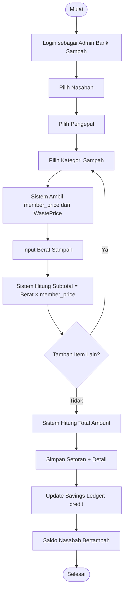
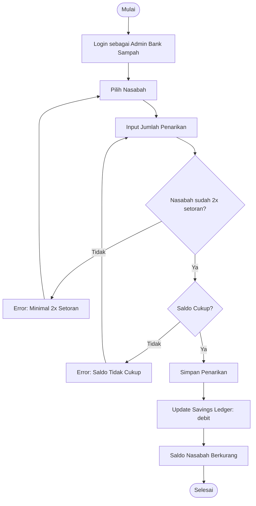
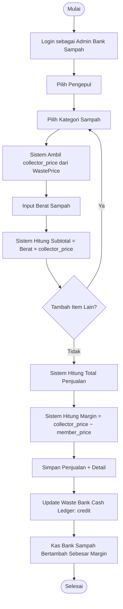
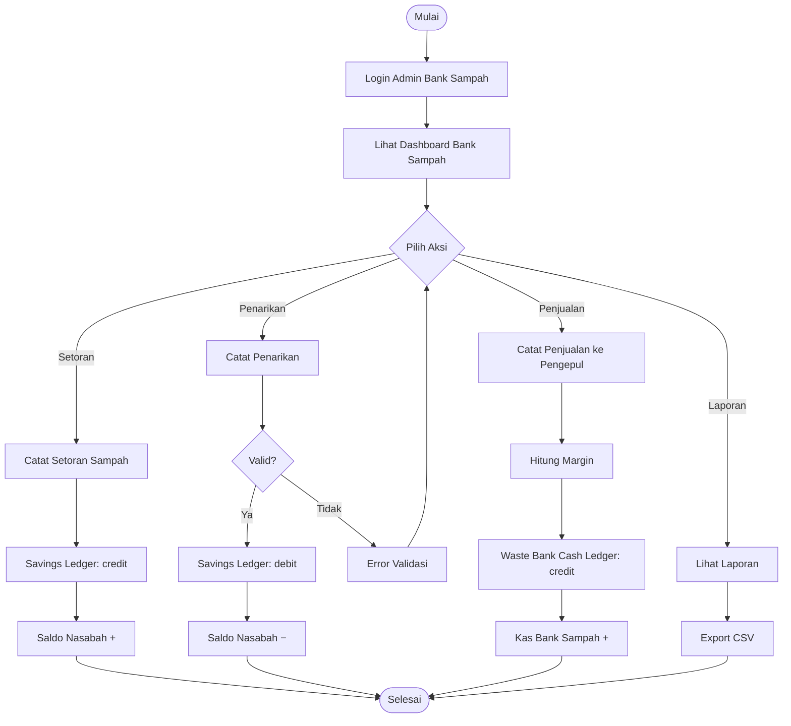

# Activity Diagram — Modul Bank Sampah

Diagram aktivitas alur operasional bank sampah: setoran, penarikan, dan penjualan.

## A. Alur Setoran Sampah (Deposit)

## B. Alur Penarikan Saldo (Withdrawal)

## C. Alur Penjualan ke Pengepul (Sale)

## D. Alur Lengkap Bank Sampah

## Keterangan

- **member_price**: Harga yang diterima nasabah saat menyetor sampah.
- **collector_price**: Harga jual ke pengepul.
- **Margin**: Selisih `collector_price − member_price`, masuk ke kas bank sampah.
- **Savings Ledger**: Mencatat mutasi saldo tabungan nasabah (credit/debit).
- **Waste Bank Cash Ledger**: Mencatat kas operasional bank sampah (hanya dari margin).
- Penarikan memerlukan minimal 2 kali setoran sebelumnya.
- Penarikan tidak boleh melebihi saldo nasabah.
