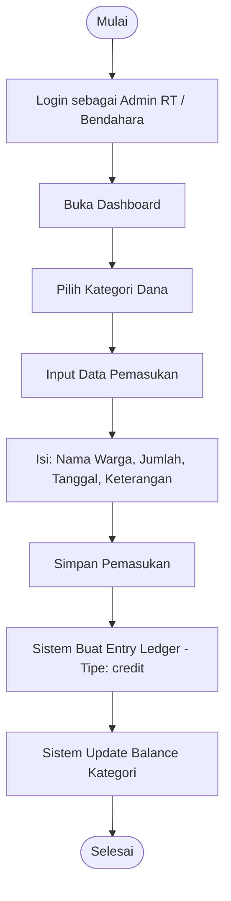
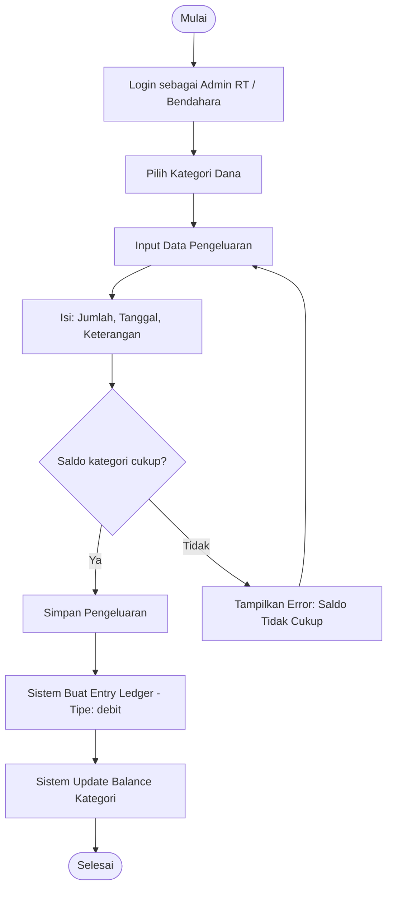
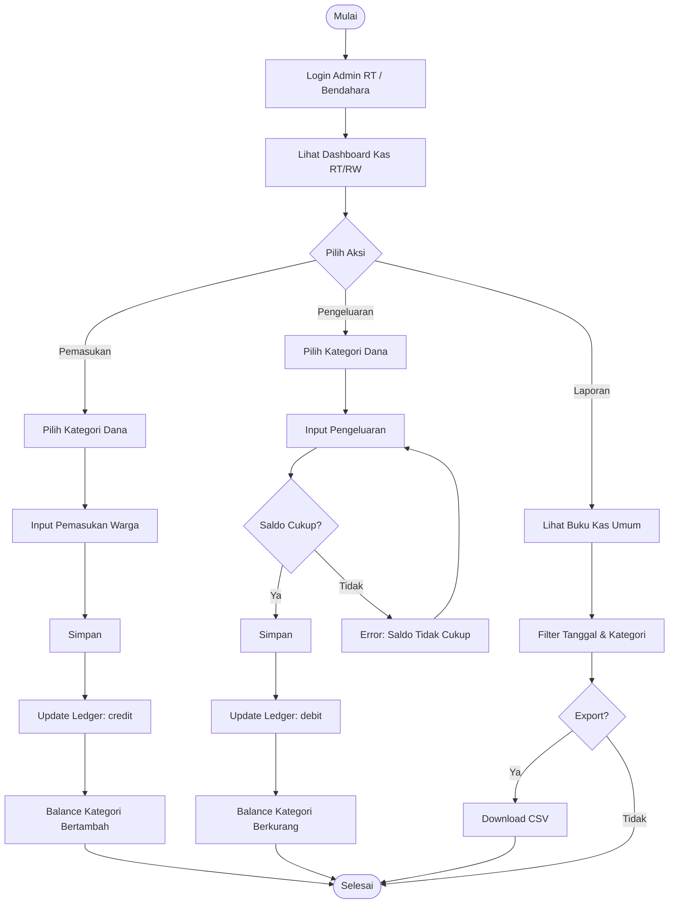

# Activity Diagram — Modul Kas RT/RW (Community Cash)

Diagram aktivitas alur pengelolaan kas RT/RW meliputi pemasukan dan pengeluaran dana.

## A. Alur Pemasukan (Kontribusi Warga)

## B. Alur Pengeluaran Dana

## C. Alur Lengkap Kas RT/RW

## Keterangan

- **Ledger** adalah sumber kebenaran (source of truth) untuk saldo setiap kategori dana.
- Setiap pemasukan menghasilkan entry ledger bertipe `credit`.
- Setiap pengeluaran menghasilkan entry ledger bertipe `debit`.
- Pengeluaran tidak boleh melebihi saldo kategori dana yang bersangkutan.
- Edit/delete transaksi otomatis melakukan recalculate pada ledger.
