# Class Diagram — Ecobank026 Custom

Diagram kelas menunjukkan model, atribut, dan relasi antar entitas dalam sistem.

## Diagram

```mermaid
classDiagram
    direction TB

    %% ============================================
    %% AUTHENTICATION & ROLES
    %% ============================================

    class User {
        +int id
        +string name
        +string email
        +string password
        +datetime email_verified_at
        +member() HasOne~Member~
    }

    class Role {
        +int id
        +string name
        +string guard_name
    }

    %% ============================================
    %% SHARED: MEMBER
    %% ============================================

    class Member {
        +int id
        +int user_id
        +string member_code
        +string name
        +string phone
        +string address
        +datetime deleted_at
        +user() BelongsTo~User~
        +contributions() HasMany~CommunityContribution~
    }

    %% ============================================
    %% MODULE: KAS RT/RW (COMMUNITY CASH)
    %% ============================================

    class FundCategory {
        +int id
        +string name
        +string description
        +decimal target_amount
        +boolean is_active
        +contributions() HasMany~CommunityContribution~
        +expenses() HasMany~CommunityExpense~
        +ledgers() HasMany~CommunityCashLedger~
    }

    class CommunityContribution {
        +int id
        +int fund_category_id
        +int member_id
        +string member_name
        +decimal amount
        +date date
        +string description
        +int recorded_by
        +fundCategory() BelongsTo~FundCategory~
        +member() BelongsTo~Member~
        +recorder() BelongsTo~User~
    }

    class CommunityExpense {
        +int id
        +int fund_category_id
        +decimal amount
        +date date
        +string description
        +int recorded_by
        +fundCategory() BelongsTo~FundCategory~
        +recorder() BelongsTo~User~
    }

    class CommunityCashLedger {
        +int id
        +int fund_category_id
        +string type
        +decimal amount
        +decimal balance
        +string reference_type
        +int reference_id
        +date date
        +string description
        +fundCategory() BelongsTo~FundCategory~
    }

    %% ============================================
    %% MODULE: BANK SAMPAH
    %% ============================================

    class WasteCategory {
        +int id
        +string name
        +string unit
    }

    class Collector {
        +int id
        +string name
        +string phone
        +string address
        +datetime deleted_at
    }

    class WastePrice {
        +int id
        +int waste_category_id
        +int collector_id
        +decimal price_per_unit
        +decimal member_price
        +decimal collector_price
        +wasteCategory() BelongsTo~WasteCategory~
        +collector() BelongsTo~Collector~
    }

    class Deposit {
        +int id
        +int member_id
        +int collector_id
        +date date
        +decimal total_amount
        +string notes
        +member() BelongsTo~Member~
        +details() HasMany~DepositDetail~
    }

    class DepositDetail {
        +int id
        +int deposit_id
        +int waste_category_id
        +decimal weight
        +decimal price_per_unit
        +decimal subtotal
        +deposit() BelongsTo~Deposit~
        +wasteCategory() BelongsTo~WasteCategory~
    }

    class Withdrawal {
        +int id
        +int member_id
        +decimal amount
        +date date
        +string notes
        +member() BelongsTo~Member~
    }

    class SavingsLedger {
        +int id
        +int member_id
        +string type
        +decimal amount
        +string description
        +string reference_type
        +int reference_id
        +member() BelongsTo~Member~
    }

    class Sale {
        +int id
        +int collector_id
        +date date
        +decimal total_amount
        +string notes
        +collector() BelongsTo~Collector~
        +details() HasMany~SaleDetail~
    }

    class SaleDetail {
        +int id
        +int sale_id
        +int waste_category_id
        +decimal weight
        +decimal price_per_unit
        +decimal subtotal
        +sale() BelongsTo~Sale~
        +wasteCategory() BelongsTo~WasteCategory~
    }

    class WasteBankCashLedger {
        +int id
        +string type
        +decimal amount
        +decimal balance
        +string reference_type
        +int reference_id
        +date date
        +string description
    }

    %% ============================================
    %% RELATIONSHIPS
    %% ============================================

    %% Auth & Roles
    User "1" -- "*" Role : hasRoles
    User "1" -- "0..1" Member : hasOne

    %% Community Cash
    Member "1" -- "*" CommunityContribution : hasMany
    FundCategory "1" -- "*" CommunityContribution : hasMany
    FundCategory "1" -- "*" CommunityExpense : hasMany
    FundCategory "1" -- "*" CommunityCashLedger : hasMany
    User "1" -- "*" CommunityContribution : records
    User "1" -- "*" CommunityExpense : records

    %% Bank Sampah
    Member "1" -- "*" Deposit : hasMany
    Member "1" -- "*" Withdrawal : hasMany
    Member "1" -- "*" SavingsLedger : hasMany
    Collector "1" -- "*" Deposit : hasMany
    Collector "1" -- "*" Sale : hasMany
    Collector "1" -- "*" WastePrice : hasMany
    WasteCategory "1" -- "*" WastePrice : hasMany
    WasteCategory "1" -- "*" DepositDetail : hasMany
    WasteCategory "1" -- "*" SaleDetail : hasMany
    Deposit "1" -- "*" DepositDetail : hasMany
    Sale "1" -- "*" SaleDetail : hasMany
```

## Pembagian Modul

### Modul Kas RT/RW (Community Cash)
- `FundCategory` — Kategori dana dengan target amount
- `CommunityContribution` — Pemasukan/iuran warga
- `CommunityExpense` — Pengeluaran dana
- `CommunityCashLedger` — Buku kas (source of truth saldo)

### Modul Bank Sampah
- `WasteCategory` — Jenis sampah dan satuan
- `Collector` — Data pengepul
- `WastePrice` — Harga dual pricing (member_price & collector_price)
- `Deposit` / `DepositDetail` — Setoran sampah nasabah
- `Withdrawal` — Penarikan saldo nasabah
- `SavingsLedger` — Mutasi tabungan nasabah
- `Sale` / `SaleDetail` — Penjualan ke pengepul
- `WasteBankCashLedger` — Kas operasional bank sampah (dari margin)

### Shared
- `User` — Akun login dengan Spatie Roles
- `Member` — Data warga/nasabah (terhubung ke kedua modul)

## Catatan Relasi

| Relasi | Keterangan |
|--------|------------|
| User → Member | Satu user bisa punya satu data member |
| Member → Deposits | Nasabah bisa punya banyak setoran |
| Member → Withdrawals | Nasabah bisa punya banyak penarikan |
| Member → SavingsLedger | Mutasi tabungan per nasabah |
| Deposit → DepositDetails | Satu setoran bisa punya banyak item sampah |
| Sale → SaleDetails | Satu penjualan bisa punya banyak item |
| WastePrice → WasteCategory + Collector | Harga unik per kombinasi kategori & pengepul |
| FundCategory → Ledgers | Saldo dihitung dari ledger entries |
