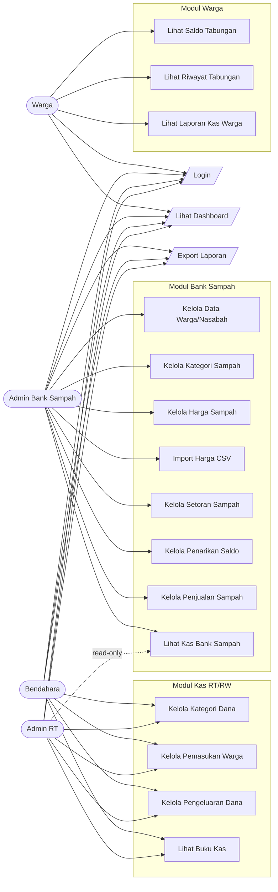

# Use Case Diagram — Ecobank026 Custom

Diagram use case sistem informasi pengelolaan Kas RT/RW dan Bank Sampah.

## Diagram

## Keterangan Aktor

| Aktor | Deskripsi |
|-------|-----------|
| Admin RT | Full akses Kas RT/RW + read-only laporan Bank Sampah |
| Bendahara | Full akses Kas RT/RW, tidak bisa akses Bank Sampah |
| Admin Bank Sampah | Full akses Bank Sampah, tidak bisa akses Kas RT/RW |
| Warga | Read-only: laporan kas, saldo tabungan, riwayat transaksi |

## Catatan

- Garis putus-putus (`-.->`) menandakan akses read-only.
- Setiap aktor harus login terlebih dahulu sebelum mengakses fitur.
- Permission dikontrol menggunakan Spatie Laravel Permission.
